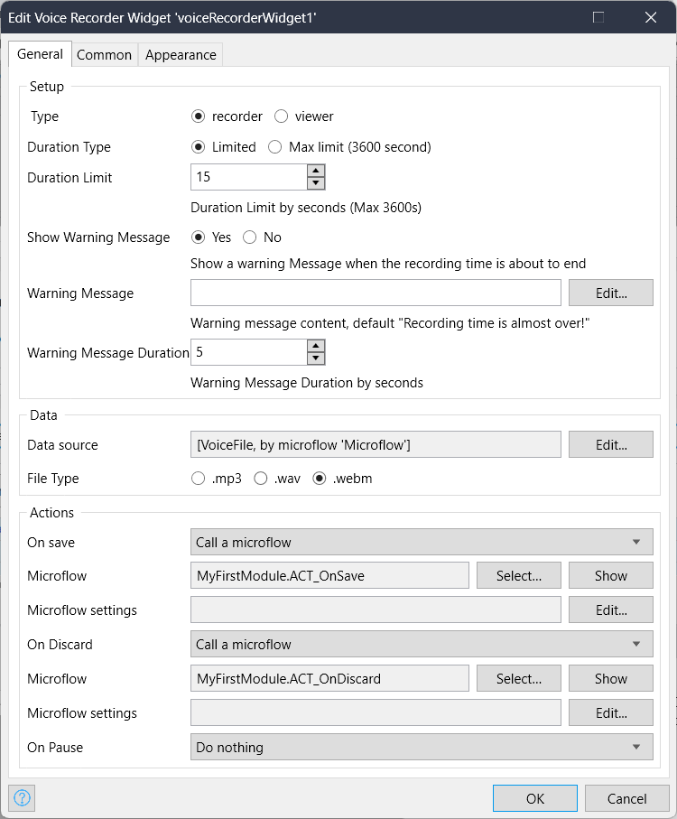

## Voice Recorder

The voice recorder widget for web is a versatile tool that enables users to capture and save audio recordings directly from a web browser. 
It offers a seamless integration into websites or web applications, allowing users to easily interact with the widget and record their voice without requiring any additional software or plugins.


## Usage
use cases potential for the voice recorder widget can include voice memos, audio notes, language learning platforms, podcast recording, customer feedback collection, or any other scenario where capturing audio is valuable.

## Features

* User-Friendly Interface. 
* Cross-Browser Compatibility.
* Playback and Preview.
* Real-Time Audio Visualization.
* File Management.


## Cofiguration settings:
1. Record and view recordings.
2. Set Recordings limit .
3. Set and show warning message based on chosen limited duration settings.
4. Set warning message text.
5. Configure recording file type.




 


## Development and contribution

```
    $ cd [cloned widget folder]
    $ npm install
    $ npm run build
    <!-- will bundle the project in root level for this project, in a widget folder -->

    <!-- node version 16.17.1 -->
```

## UI (CSS classes)
```
// Viewer
.voice-viewer-container

// recording
.voice-recorder-container
.error-msg
.duration-container
.warning
.record-process

// player
.audio-player-container
.timeline-container
.timeline-slider
.timers-container

// animation
.loading-lds-ellipsis
.recording-lds-ripple

// icons
.process-icon
.sound-icon
.play-icon
.mic-icon
.stop-icon
.save-icon
.discard-icon
```